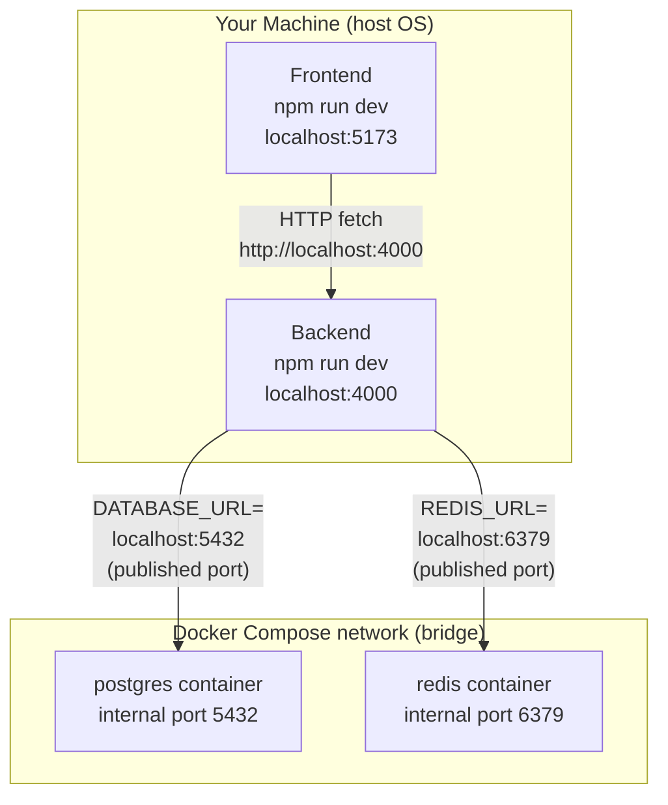
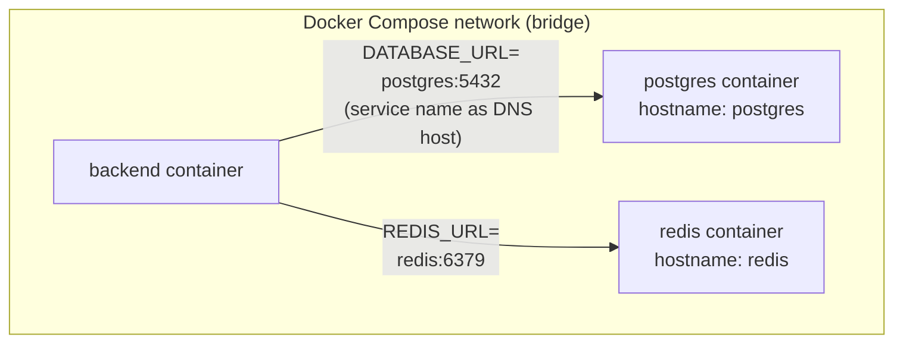

# Phase 1 Checkpoint: How the pieces talk to each other

## The two different connection paths

Right now, only **Postgres** and **Redis** run inside Docker (defined in
`docker-compose.yml`). The **frontend** and **backend** run directly on your
machine via `npm run dev` — not containerized. That's a deliberate dev-mode
choice: running them natively gives instant hot-reload without rebuilding a
Docker image on every code change.

This means there are two *different* networking mechanisms at play, and it's
important not to mix them up.



### 1. Frontend → Backend

Plain HTTP over `localhost`, because both are just ordinary processes running
on your OS. Nothing Docker-specific here — it's the same as any two local dev
servers talking to each other.

### 2. Backend → Postgres / Redis (today)

The backend is **not** inside the Compose network, so it can't use Docker's
internal service-name DNS. Instead it reaches the containers through the
**published ports** declared in `docker-compose.yml`:

```yaml
ports:
  - "5432:5432"   # host_port:container_port
```

This tells Docker: "take port 5432 inside the container and expose it as port
5432 on the host's network interface." That's why `backend/.env` points at
`localhost:5432` and `localhost:6379` — from the backend process's point of
view, it's just talking to a port on its own machine. Docker is transparently
forwarding that traffic into the container.

## How it *would* work if the backend were containerized too

This is the model the Phase 1 checkpoint question in the brief is really
pointing at, and it's exactly what we'll set up for the Phase 8 production
Docker Compose file. If `backend` were declared as a service in the same
`docker-compose.yml`:



Key differences from today's setup:

- **Service name as hostname.** Compose creates a private DNS server for the
  network it builds. Every service can resolve every other service's name
  (`postgres`, `redis`, `backend`, …) to that container's internal IP — no
  `localhost`, no published ports needed for container-to-container traffic.
- **Internal port, not published port.** The connection would use the
  container's internal port (`5432`) directly — publishing to the host
  (`ports:`) is only needed so things *outside* the Compose network (your
  browser, a host-run process, `psql` from your terminal) can reach in.
- **`depends_on`** controls start order (e.g. don't start `backend` until
  `postgres` is running), but does **not** wait for Postgres to be *ready to
  accept connections* — just that its container has started. That's why our
  backend's `/health` endpoint retries/reports failure gracefully instead of
  assuming the DB is instantly available.

## One-sentence answer for the checkpoint

> Within a Compose network, containers find each other by service name via
> Docker's built-in DNS; from outside that network (your host machine, or any
> process not in Compose), you reach a container only through the port it
> explicitly publishes to the host. Today, only Postgres/Redis are
> containerized, so the backend reaches them via published ports on
> `localhost`; once the backend itself joins the Compose network (Phase 8),
> it'll address them by service name instead.
