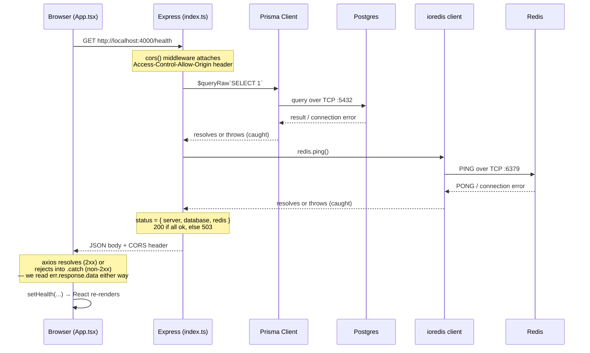

# Phase 1 backend concepts: request/response flow

Companion to the chat explanation of Prisma, Postgres, CORS, and Redis. This
diagram traces one real request — the frontend's health check — end to end
through our actual code.

## Why CORS only matters for the browser leg

`curl http://localhost:4000/health` works with no CORS setup at all, because
CORS is a rule browsers enforce on JavaScript, not a rule servers enforce on
callers in general. The `cors()` middleware exists purely because step 1
above is initiated by a browser running our frontend's JS on a different
origin (`:5173`/`:5174` vs `:4000`).

## Why both dependency checks are independent try/catch blocks

Postgres and Redis are unrelated systems. If Postgres is down but Redis is
fine, we still want an accurate `{ database: "error", redis: "ok" }` — not a
crash that tells us nothing. Each check fails in isolation on purpose.
