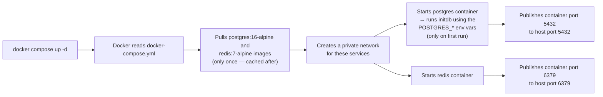
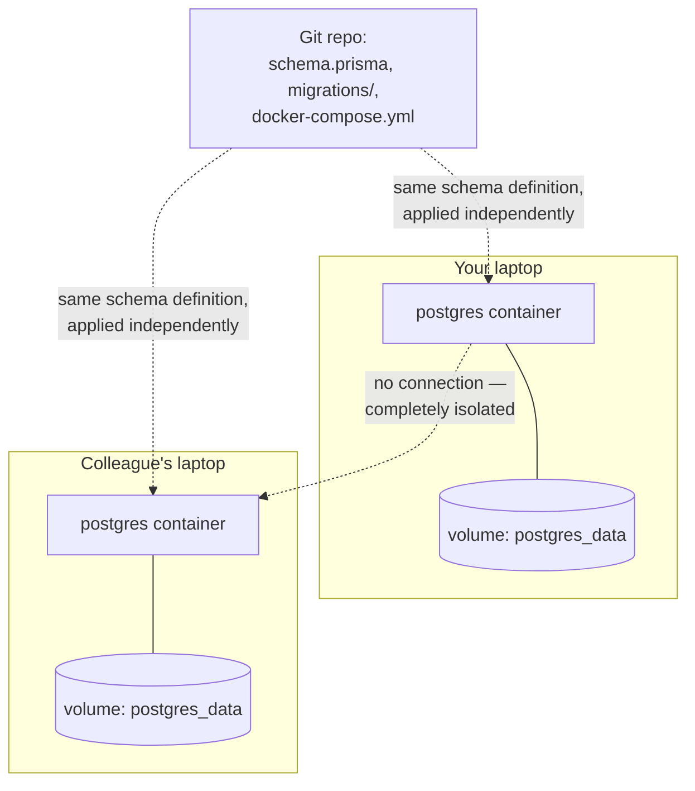

# Docker & docker-compose.yml, explained

## What Docker actually is, in one paragraph

A **container** is a lightweight, isolated process: its own filesystem, its
own view of "localhost," its own installed software — but sharing the host
machine's kernel (unlike a full virtual machine, which is why containers
start in ~1 second instead of ~1 minute). An **image** is the frozen
snapshot/blueprint a container is created from (e.g. `postgres:16-alpine` —
a pre-built image containing a full working copy of Postgres 16, with
nothing else installed on your machine). **Docker Compose** is a tool for
describing several containers ("services") and how they relate to each
other, in one YAML file, and starting/stopping them together as a group.

## Our `docker-compose.yml`, line by line

```yaml
services:
  postgres:                          # service name — also becomes its DNS
                                      # hostname for other containers on the
                                      # same Compose network (see the Phase 1
                                      # architecture doc for that piece)
    image: postgres:16-alpine        # which prebuilt image to run; "alpine"
                                      # = a minimal Linux base, smaller image
    restart: unless-stopped          # if the container crashes, Docker
                                      # restarts it automatically
    environment:                     # env vars passed INTO the container;
                                      # the postgres image reads these on
                                      # first boot to create the initial user/db
      POSTGRES_USER: postgres
      POSTGRES_PASSWORD: postgres
      POSTGRES_DB: workmgmt
    ports:
      - "5432:5432"                  # "host_port:container_port" — makes
                                      # the container reachable from your
                                      # actual machine at localhost:5432
    volumes:
      - postgres_data:/var/lib/postgresql/data
                                      # persist the DB's data directory
                                      # OUTSIDE the container (see below)
    healthcheck:                     # lets Docker (and other tools) know
      test: ["CMD-SHELL", "pg_isready -U postgres"]
      interval: 5s                   # when the DB is actually ready to
      timeout: 5s                    # accept connections, not just "the
      retries: 5                     # container process has started"

  redis:
    image: redis:7-alpine
    # ...same shape, different image/port
```

That's genuinely most of the syntax you need for a project like this:
`image`, `environment`, `ports`, `volumes`, `healthcheck`, and — once we
containerize our own backend in Phase 8 — `build` (build an image from our
own `Dockerfile` instead of pulling a public one) and `depends_on` (start
order between our services).

## Why persist data in a `volumes:` at all?

A container's own filesystem is **thrown away** when the container is
removed (`docker compose down` without `-v`, or `docker rm`). If Postgres
wrote your tasks/projects/users straight into the container's own
filesystem, restarting the container for any reason (an image update, a
crash, a laptop reboot) would silently wipe your database.

A **named volume** (`postgres_data`, `redis_data` — declared at the bottom
under `volumes:`) is storage that Docker manages *outside* any single
container's lifecycle. The container mounts it at a specific path
(`/var/lib/postgresql/data`, where Postgres keeps its actual data files),
so the container can be deleted and recreated freely while the data
underneath survives. `docker compose down -v` is the explicit "actually
delete the volumes too" command — useful when you want a truly clean slate.

## What actually happens when you run `docker compose up -d`



`-d` means "detached" — run in the background instead of tying up your
terminal. `docker compose ps` shows what's running; `docker compose logs
postgres` shows that one service's logs; `docker compose down` stops and
removes the containers (but keeps the named volumes, so your data is safe)
unless you add `-v`.

## Why containerize Postgres/Redis at all — why not just install them normally?

- **No version drift between machines.** Your office laptop and personal
  laptop (and eventually a teammate's machine, or CI) all get *exactly*
  `postgres:16-alpine` — not whatever version each OS's package manager
  happens to install.
- **Zero host pollution.** Nothing gets installed system-wide, nothing
  fights with another project's Postgres version, nothing lingers as a
  background service you forgot about. Delete the container, it's gone.
- **One-command teardown/reset.** `docker compose down -v` gives you a
  completely fresh database in seconds — genuinely useful when testing
  migrations or just wanting a clean slate, which is a real pain with a
  natively-installed DB.
- **Matches how this ships later.** The exact same file (extended in Phase
  8) is what we deploy to AWS — dev and prod use the same container
  definitions, not "works on my machine" configuration drift.

The tradeoff, which you already hit firsthand: containers need a working
hypervisor (Hyper-V/WSL2 on Windows), which is why Docker Desktop failed to
start on the office laptop with virtualization disabled by IT policy. That's
the main real cost of this approach.

## Does everyone's container share the same database? (No — and this matters)

A very natural assumption is that "containerizing Postgres" means there's
now one server that everyone's app connects to. That's **not** what's
happening here. Each machine that runs `docker compose up -d` gets its
**own, fully independent** Postgres container — with its own volume, its
own data, on its own machine. Nothing is shared between them over the
network.



**What actually gets shared, via Git, is the *shape* of the database** — the
`schema.prisma` file and (from Phase 3 onward) the migration files in
`prisma/migrations/`. When your colleague runs `prisma migrate dev` against
their own fresh container, they get a database with identical *tables and
columns* to yours — but zero of your actual *rows*. If you create a task on
your machine, it exists only in your container's volume. Your colleague's
container knows nothing about it.

This is deliberate, not a limitation:
- **Isolation.** You can create garbage test data, drop tables, or break
  your schema experimenting, without affecting anyone else.
- **No shared state to fight over.** Nobody needs network access to your
  laptop, and there's no "someone else's bad data broke my local testing."
- **Disposable.** `docker compose down -v` gives you a totally clean slate
  any time, without asking anyone's permission.

**When would data actually need to be shared** across people or machines?
Only once there's a database that isn't local-per-developer — e.g. a real
shared staging environment, or the Phase 8 AWS RDS instance. In that case,
the *backend* (wherever it's deployed) would point its `DATABASE_URL` at
that one remote server's address instead of `localhost`, and everyone
connecting to that deployed backend would see the same data — because
they're all talking to the same actual running Postgres process, over the
network, rather than each having their own local container. That's a
different setup from what we have today (each dev's own local container),
and it's exactly what Phase 8's deployment step does — one shared instance,
reached over the network rather than `localhost`.
