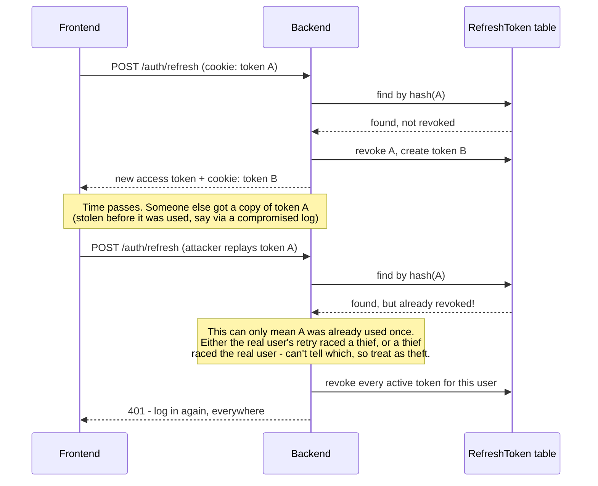

# Phase 2: Authentication & RBAC

## The token model

Two different kinds of credential, deliberately handled differently:

| | Access token | Refresh token |
|---|---|---|
| **Format** | JWT, signed with `JWT_ACCESS_SECRET` | Random opaque string (not a JWT) |
| **Lifetime** | 15 minutes | 7 days |
| **Where it lives** | Frontend memory only (never storage) | `httpOnly` cookie (JS can't read it) |
| **Sent as** | `Authorization: Bearer <token>` header | Automatically, by the browser, via the cookie |
| **Can the server revoke it early?** | No — it's self-contained and valid until it expires | Yes — every one is a row in the `RefreshToken` table |

### Why is the access token short-lived and stateless?

A JWT is *self-verifying* — the server checks its signature and trusts the payload without a database lookup. That's what makes it fast (no DB round-trip on every request), but it also means **the server can't invalidate one early**. If an access token leaks, it's usable until it naturally expires. Keeping that window to 15 minutes bounds the damage. Everything that actually needs to be revokable (logout, password reset, detected token theft) is enforced on the **refresh** token instead, which the server can look up and kill instantly.

### Why is the refresh token a DB-backed opaque string, not a second JWT?

If it were also a JWT, the server would face the same problem as above, just for a longer-lived, more valuable credential — bad tradeoff. Instead, [backend/src/lib/tokens.ts](../backend/src/lib/tokens.ts) generates 48 random bytes and stores only its **SHA-256 hash** in the `RefreshToken` table (same principle as password hashing — if the DB leaked, the stored hashes are useless without the original random value the browser holds in its cookie).

## Refresh rotation, and why it defeats token theft

Every time `/auth/refresh` is called ([backend/src/routes/auth.ts](../backend/src/routes/auth.ts)):

1. The presented token is looked up by its hash.
2. If valid, it's immediately marked `revokedAt` (dead — one-time use) and a **brand new** refresh token is issued and stored, linked via `replacedByTokenHash`.
3. The response sets the new token as the cookie. The old one now works for nothing, ever again.

This is the concrete answer to the Phase 2 checkpoint question: a stolen refresh token isn't a standing backdoor. The **first** use of a stolen token (by either party — attacker or real user, whoever gets there first) immediately poisons it for the other side, and the very next attempt to reuse it triggers **reuse detection** ([backend/src/routes/auth.ts](../backend/src/routes/auth.ts), the `stored.revokedAt` branch in `/auth/refresh`), which nukes every active session for that user rather than just rejecting one request. The blast radius of a leaked refresh token is bounded to "one silent use before it's caught," not "valid for 7 days."

## Why the frontend needs a single-flight refresh lock

Rotation being one-time-use creates a real bug risk: if two API calls fail with 401 at the same instant (easy to trigger — e.g. two components fetching data on the same page after the access token expired), and each independently calls `/auth/refresh`, the **second** one would present a token the **first** one already rotated away — indistinguishable, from the server's point of view, from theft. It would trigger reuse detection and silently log the user out everywhere.

[frontend/src/lib/api.ts](../frontend/src/lib/api.ts) guards against this with a shared `refreshPromise`: the first 401 kicks off a refresh; every other request that hits a 401 while that's in flight awaits the *same* promise instead of starting its own. Only one refresh call is ever sent at a time.

## RBAC middleware

Two small, composable pieces in [backend/src/middleware/auth.ts](../backend/src/middleware/auth.ts):

- **`authenticate`** — answers "who is this?" (authentication). Verifies the JWT, attaches `req.user`. Fails with `401` if there's no valid access token.
- **`authorize(...roles)`** — answers "are they allowed to do *this*?" (authorization). Runs after `authenticate`, checks `req.user.role` against an allow-list. Fails with `403` if the role isn't permitted.

These compose per-route: `router.post('/users', authenticate, authorize(Role.ADMIN), handler)` — `/auth/users` (creating a teammate) requires both being logged in *and* being an Admin. The frontend's [CreateTeammateForm](../frontend/src/components/CreateTeammateForm.tsx) is a real demonstration of this, not a stub: it's only rendered for an `ADMIN` user, and even if a non-admin somehow called the endpoint directly, the backend would still reject it with `403` — the enforcement lives server-side, the frontend hiding the button is just UX polish.

## Password reset

`/auth/forgot-password` always responds identically whether or not the email exists (prevents an attacker from using it to enumerate registered accounts). A reset token — generated and hashed the same way as a refresh token — is stored with a 30-minute expiry. Since this project has no email provider configured (staying zero-cost), the reset link is logged to the server console instead of actually emailed — noted directly in the code, not hidden. `/auth/reset-password` consumes the token exactly once and, importantly, **revokes every active refresh token for that user** — changing your password logs you out everywhere, not just resets the password while old stolen sessions stay valid.

## One-sentence answer for the checkpoint

> Access tokens are short-lived and unrevokable by design, so a leak is bounded by time (15 minutes); refresh tokens are long-lived but revokable, and rotation means each one works exactly once — reusing an already-rotated token is detected as theft and revokes every session for that user, so a stolen refresh token is good for at most one silent use before the legitimate owner's next refresh (or the thief's) exposes and kills it.
