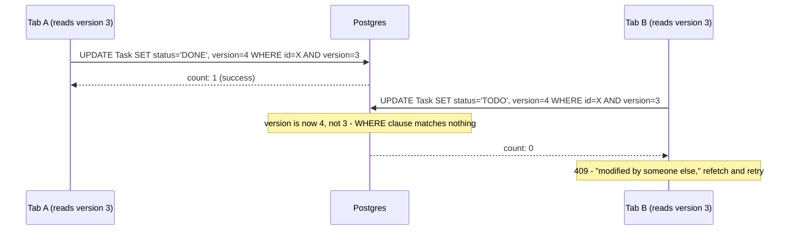
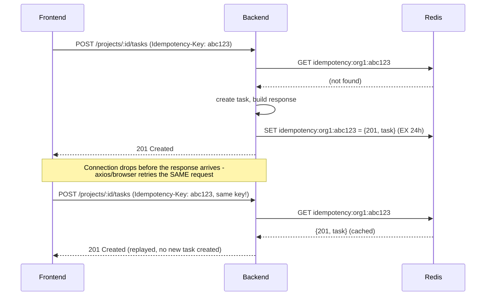

# Phase 5: Optimistic Concurrency Control

## Optimistic vs. pessimistic locking

**Pessimistic locking** prevents the conflict from ever happening: before you read a row you intend to change, you lock it (`SELECT ... FOR UPDATE` in Postgres), and anyone else who wants to touch that row blocks until you release the lock. Safe, but expensive — a held lock ties up a database connection and blocks other work for as long as the lock holder takes, including a slow human thinking about what to type next.

**Optimistic locking** assumes conflicts are rare, lets everyone proceed without waiting, and only checks for a conflict at the moment of writing. That's the right assumption here: most tasks are never edited by two people within the same few seconds, so paying a locking cost on every single read to guard against a rare case is wasted cost. Optimistic concurrency only spends effort when a conflict *actually* happens, in exchange for the failure mode being "your update is rejected, try again" instead of "you're blocked until they finish."

**When to choose pessimistic instead:** when conflicts are frequent enough that redoing rejected work is itself expensive, or when correctness can't tolerate even a rejected/retried attempt (e.g., decrementing a limited inventory count, where you'd rather block briefly than let two people simultaneously think they got the last item). A task's status field is neither of those — pessimistic locking would be solving a problem this app doesn't really have.

## How the version check actually closes the race

The naive approach — read the task, check its status hasn't changed, then write — has a gap between the check and the write where another request can slip in. [backend/src/routes/tasks.ts](../backend/src/routes/tasks.ts)'s `PATCH /tasks/:id` avoids that gap entirely by making the check *part of* the write, as a single atomic database operation:

```ts
const result = await prisma.task.updateMany({
  where: { id: task.id, version: clientVersion },
  data: { ...data, version: { increment: 1 } },
});

if (result.count === 0) {
  // already confirmed the task exists, so this can only mean the version
  // didn't match - someone else updated it first
  const current = await prisma.task.findUnique({ where: { id: task.id } });
  res.status(409).json({ error: '...', current });
  return;
}
```

Postgres executes `UPDATE ... WHERE id = ? AND version = ?` as one indivisible operation — there is no window between "check the version" and "apply the change" for a second request to squeeze into, because the database itself is doing the checking and writing in the same step. If two requests race to update the same task, the database picks a winner atomically: exactly one `UPDATE` matches the `WHERE` clause and succeeds (bumping the version), and the other finds `count: 0` because by the time its own `UPDATE` runs, the version has already moved. There's no ambiguity, no lost update, and no lock held while a human is thinking.



## Idempotency keys: a different problem, easily confused with the one above

This isn't about two *different* people editing the same thing — it's about the *same* logical request possibly being sent more than once. A slow or flaky connection can cause a client to retry a `POST` it never got a confirmed response for, with no way to know whether the server actually processed the first attempt or not. Without protection, that retry creates a second, duplicate task.

The fix, in [backend/src/middleware/idempotency.ts](../backend/src/middleware/idempotency.ts): the client generates a random key once per *user-intent* action (one click of "Create task" = one key) and sends it as an `Idempotency-Key` header. The server checks Redis for that key before doing anything:

- **Not seen before:** proceed normally, and once a successful response is ready, cache it in Redis (keyed by org + the client's key, expiring after 24 hours) before sending it.
- **Already seen:** skip the handler entirely and return the exact same response that was cached the first time — no second task gets created, and the client can't even tell the difference between "this just ran" and "this already ran a moment ago."



**Why this is a different safeguard than the disabled submit button.** [ProjectDetailPage.tsx](../frontend/src/pages/ProjectDetailPage.tsx)'s create-task button already disables itself while `createTask.isPending` — that stops a human from clicking twice. But a network-level retry happens *underneath* that: the browser (or a proxy, or axios's own retry logic) can resend a request the human only "clicked" once, with no visible sign anything doubled up. The button guards against a slow human; the idempotency key guards against a fast network doing something the human never asked for twice. Both matter, and neither replaces the other.

**Why the key must come from the *frontend*, not be generated per-attempt inside axios's retry logic:** [frontend/src/pages/ProjectDetailPage.tsx](../frontend/src/pages/ProjectDetailPage.tsx) generates the key once, right when `mutationFn` runs (i.e., once per `.mutate()` call — once per actual user action). If our axios response interceptor internally retries the *same* request object after a 401 (see [frontend/src/lib/api.ts](../frontend/src/lib/api.ts)'s refresh-and-retry logic from Phase 2), that retry reuses the same request config and therefore the same header — which is exactly correct, since it's still the same logical action. A *new* button click, by contrast, runs `mutationFn` again and gets a fresh key, because it's a genuinely new intent.

**Why Redis failures don't block task creation.** [backend/src/middleware/idempotency.ts](../backend/src/middleware/idempotency.ts) treats Redis as best-effort: if it's unreachable, the middleware fails open (calls `next()` and lets the request through unprotected) rather than returning an error. Losing idempotency protection during a Redis outage is a much smaller problem than being unable to create any tasks at all because a caching layer went down — the same "non-critical dependency shouldn't take down a critical path" principle behind the `/health` endpoint's independent try/catch blocks from Phase 1. Making that fail-open path actually *fast* required one more change: ioredis's default `maxRetriesPerRequest` (20) meant a command issued while Redis was down could sit queued for up to ~20 seconds before finally giving up — turned down to `1` in [backend/src/redis.ts](../backend/src/redis.ts) so "fall back to normal behavior" is actually fast, not a multi-second stall before the fallback even kicks in.

## Checkpoint

*Explain optimistic vs. pessimistic locking and when you'd choose each* — see the first section above. *Explain how an idempotency key prevents duplicate task creation on a network retry* — see the diagram: the server remembers the outcome of a request under its key, and a resend of the same request just replays that outcome instead of running the creation logic a second time.
