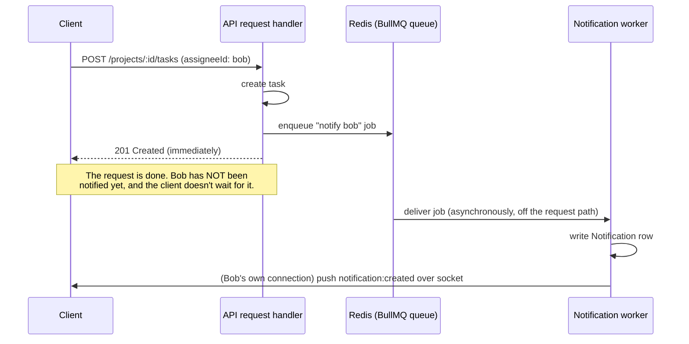

# Phase 7: Workload View & Basic Notifications

## Aggregation: database GROUP BY, not "load everything and sum in JS"

[backend/src/routes/workload.ts](../backend/src/routes/workload.ts) computes each person's current workload with `prisma.task.groupBy`:

```ts
prisma.task.groupBy({
  by: ['assigneeId'],
  where: { organizationId, status: { not: 'DONE' }, assigneeId: { not: null } },
  _sum: { estimatedHours: true },
});
```

This compiles down to a single `SELECT assigneeId, SUM(estimatedHours) FROM "Task" WHERE ... GROUP BY assigneeId` — Postgres does the summing, once, over however many rows match. The alternative — `prisma.task.findMany(...)` to pull every matching task into Node, then `.reduce()` over them in JavaScript — would work identically for a handful of tasks, but degrades as the organization's task count grows: every row has to cross the network and get held in memory just to compute a number the database could hand back directly. This is the "simple aggregation" the brief means: not a complex algorithm, but the habit of pushing aggregation down to where the data already lives.

**Only non-`DONE` tasks count.** A completed task no longer represents pending work — including it would make someone's workload look permanently inflated by everything they've ever finished, which isn't what "how loaded is this person *right now*" is asking.

## The queue: decoupling "decide to notify" from "actually notify"

Creating a task, reassigning one, or posting a comment can *trigger* a notification, but the request that does that shouldn't have to wait for the notification to be fully processed. [backend/src/routes/projects.ts](../backend/src/routes/projects.ts) and [tasks.ts](../backend/src/routes/tasks.ts) only ever call `enqueueNotification(...)` — a fast, fire-and-forget push onto a Redis-backed queue:

```ts
if (parsed.data.assigneeId && parsed.data.assigneeId !== req.user!.id) {
  await enqueueNotification({
    userId: parsed.data.assigneeId,
    organizationId: req.user!.organizationId,
    type: 'TASK_ASSIGNED',
    message: `You were assigned to "${task.title}"`,
    taskId: task.id,
  });
}
```

The actual work — writing the `Notification` row, pushing it to the recipient's browser over their socket — happens separately, in [backend/src/queue/notificationsWorker.ts](../backend/src/queue/notificationsWorker.ts), picked up off the queue whenever it's ready:



**Why not just write the notification inline, in the same handler?** Nothing about creating a task strictly *needs* a notification row to exist before it can respond - correctness for the task creation doesn't depend on it. Making the request wait on that anyway would tie the speed (and the failure modes) of an unrelated side-effect to the main action's response time, for no benefit to the caller.

## Fault isolation: what happens when the worker fails

`enqueueNotification` wraps the enqueue call in a try/catch that only logs on failure — if Redis itself is unreachable, the task/comment action that triggered it has *already succeeded* and returns normally regardless:

```ts
export async function enqueueNotification(data: NotificationJobData): Promise<void> {
  try {
    await notificationsQueue.add('notify', data, { attempts: 3, backoff: { type: 'exponential', delay: 2000 } });
  } catch (err) {
    console.error('Failed to enqueue notification:', err);
  }
}
```

If the job *does* get enqueued but the worker fails while processing it (a transient DB hiccup, say), BullMQ retries it automatically per the `attempts`/`backoff` above - and even if every retry is exhausted, [notificationsWorker.ts](../backend/src/queue/notificationsWorker.ts)'s `'failed'` handler just logs it:

```ts
worker.on('failed', (job, err) => {
  console.error(`Notification job ${job?.id} failed after all retries:`, err.message);
});
```

Nothing here ever reaches back to unwind the original request. A user losing a notification is a real gap, but a much smaller one than losing (or blocking) the task update itself — this is the actual point of putting the queue between them: a failure on one side of it can't propagate to the other.

## Why the worker needs its own Redis connection

[backend/src/queue/connection.ts](../backend/src/queue/connection.ts) creates a dedicated `IORedis` instance for BullMQ, separate from the app's existing `redis` client from Phase 1/5:

```ts
export const queueConnection = new IORedis(process.env.REDIS_URL || 'redis://localhost:6379', {
  maxRetriesPerRequest: null,
});
```

The app's main `redis` client deliberately sets `maxRetriesPerRequest: 1` (Phase 5 - so the idempotency check fails fast if Redis is down, rather than stalling). BullMQ needs the opposite: it holds long-lived *blocking* Redis commands open while waiting for new jobs, and requires `maxRetriesPerRequest: null` so those waits aren't torn down by a retry cap that was tuned for a completely different use case. Sharing one connection between the two would force one of them to use settings tuned for the other.

## Where the worker actually runs (and the honest simplification here)

[backend/src/index.ts](../backend/src/index.ts) calls `startNotificationsWorker()` right alongside `initRealtime()` - the worker runs in the **same Node process** as the API server. In a system built to scale, this worker would run as its own separate deployable process (a container that does nothing but drain this queue), so a burst of notification processing can never compete with the API server's own event loop for CPU time. For this project's scale, that separation isn't worth the added deployment complexity - but it's worth being clear that the **queue itself**, not which process happens to host the worker, is what creates the decoupling. Enqueue and process are still two separate steps on two separate code paths regardless of whether they share a process; splitting the worker into its own process later would be an operational change, not a redesign.

## Checkpoint

*Why notification sending is queued instead of done inline; what happens if the worker fails* — see the two middle sections above.
